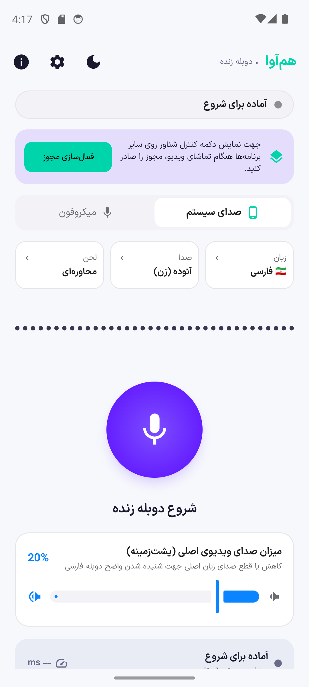
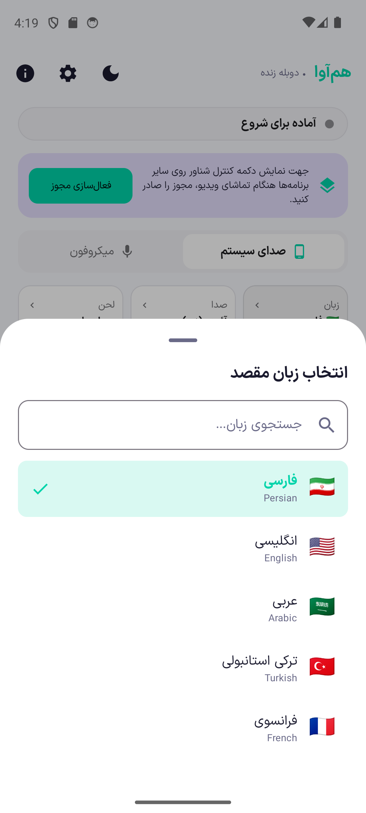
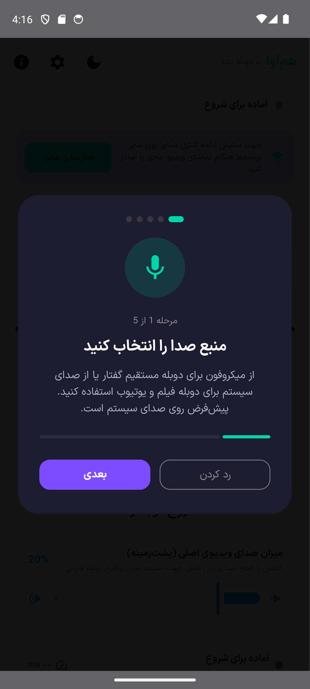
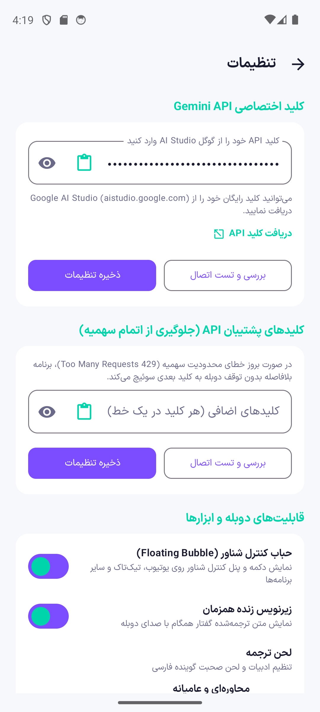
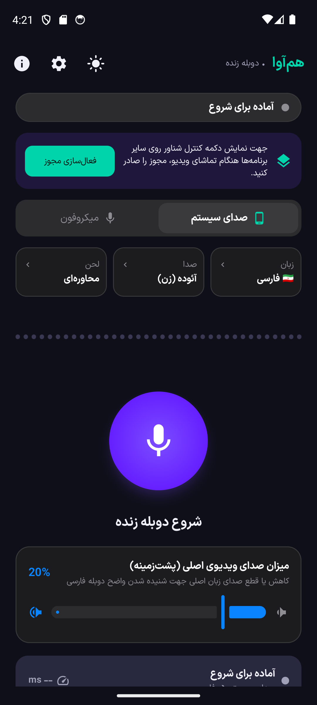

# هم‌آوا (HamAva)

**فارسی** · [English](README.en.md)

اپلیکیشن اندروید رایگان، متن‌باز و مدرن برای **دوبله زنده و بلادرنگ صدا با هوش مصنوعی (Google Gemini Live API)** — ترجمه و بازتولید گفتاری صدای فیلم‌ها، ویدیوها، پادکست‌ها و مکالمات با صدای طبیعی انسانی.

<div dir="ltr" align="center">

`نسخهٔ ۱.۰.۰` · اندروید ۱۰ (API 29) و بالاتر · کد پکیج: `com.afrouzi.hamava` · مجوز Apache 2.0

</div>

---

## پیش‌نمایش محیط برنامه

<div align="center">

| صفحه اصلی (روشن) | انتخاب زبان (Bottom Sheet) | تور راهنمای تعاملی | تنظیمات و کلیدها | صفحه اصلی (تاریک) |
| :---: | :---: | :---: | :---: | :---: |
|  |  |  |  |  |

</div>

---

## چه کاری انجام می‌دهد

### ۱. دوبله زنده صدای داخلی سیستم (فیلم‌ها، ویدیوها و پادکست‌ها)
بدون نیاز به ضبط با میکروفون و بدون تداخل نویزهای محیطی، «هم‌آوا» از طریق قابلیت استاندارد `AudioPlaybackCapture` در اندروید ۱۰ به بعد، جریان خام صدای برنامه‌های در حال پخش (یوتیوب، اینستاگرام، آپارات، تلگرام و پخش‌کننده‌های ویدیو) را با فرکانس ۱۶ کیلوهرتز دریافت کرده و همزمان با صدای طبیعی هوش مصنوعی به فارسی روان دوبله می‌کند. صدای سیستم به عنوان منبع پیش‌فرض تنظیم شده است تا تنها با یک لمس بتوانید تماشای ویدیوها را آغاز کنید.

### ۲. دوبله همزمان گفتار با میکروفون
برای جلسات، وبینارها، کلاس‌های درسی و گفتگوهای حضوری، می‌توانید منبع ورودی را روی میکروفون قرار دهید. مجهز بودن به حذف نویز سخت‌افزاری (AEC) و تشخیص سکوت خودکار، مانع از بازگشت صدا یا مصرف بی‌رویه اینترنت و سهمیه API می‌شود.

### ۳. کنترل مستقل بلندی صدای ویدیوی اصلی (Audio Ducking)
هنگام تماشای فیلم زبان اصلی، شنیدن همزمان دو زبان می‌تواند تمرکز را مختل کند. اسلایدر کنترل بلندی صدای اصلی در هم‌آوا به شما امکان می‌دهد صدای ویدیوی مبدأ را از ۰٪ تا ۱۰۰٪ کم کنید یا به کل ببندید تا صدای گوینده فارسی با شفافیت کامل شنیده شود.

### ۴. شخصی‌سازی زبان، گوینده و لحن ترجمه
- **زبان مقصد:** پشتیبانی از بیش از ۷۰ زبان زنده دنیا (فارسی، انگلیسی، عربی، ترکی، آلمانی، فرانسوی، اسپانیایی، چینی، روسی و...).
- **صداهای هوش مصنوعی:** انتخاب از بین ۶ صدای طبیعی و بااحساس گوگل (Aoede, Charon, Fenrir, Kore, Puck, Zephyr).
- **لحن گفتار (Tone):** انتخاب ادبیات دوبله در ۳ قالب کاربردی:
  - *محاوره‌ای و عامیانه:* مخصوص فیلم‌ها، شبکه‌های اجتماعی و گفتگوهای روزمره.
  - *رسمی و اداری:* مخصوص اخبار، مقالات و سمینارهای علمی.
  - *تخصصی و فنی:* حفظ و ترجمه اصطلاحات دقیق مهندسی و پزشکی.

### ۵. حباب شناور و زیرنویس همزمان (Floating Overlay)
یک ویجت شناور کاربردی روی تمام برنامه‌ها قرار می‌گیرد که دکمه‌های توقف موقت (Pause)، ادامه (Resume)، بستن کامل و اسلایدر صدا را بدون ترک ویدیوی اصلی در اختیارتان می‌گذارد. همچنین متن زیرنویس زنده همگام با صوت دوبله بر روی صفحه نمایش داده می‌شود.

### ۶. مدیریت کلیدهای پشتیبان API (Fallback Keys)
برای جلوگیری از توقف دوبله هنگام مواجهه با محدودیت تعداد درخواست (خطای HTTP 429 Too Many Requests)، می‌توانید چندین کلید رایگان Google Gemini وارد کنید. برنامه سلامت کلیدها را با یک دکمه بررسی کرده و در صورت پایان سهمیه یک کلید، بلافاصله و نامحسوس به کلید بعدی سوئیچ می‌کند.

### ۷. پروکسی محلی ضدتحریم (SOCKS5 & HTTP)
جهت دور زدن اختلالات شبکه یا تحریم‌های گوگل، می‌توانید مستقیماً آدرس پروکسی محلی خود (مانند v2ray یا Clash روی پورت 10808) را در بخش تنظیمات وارد کنید تا اتصال وب‌سوکت با بالاترین پایداری برقرار شود.

### ۸. تم روشن، تاریک و هماهنگ با سیستم
رابط کاربری مدرن Material 3 به طور پیش‌فرض از تنظیمات سیستم گوشی شما پیروی می‌کند. همچنین یک دکمه تغییر سریع تم در نوار بالای صفحه تعبیه شده است تا در کسری از ثانیه بین حالت شب و روز جابه‌جا شوید.

---

## تفکیک نسخه‌های کافه بازار و مایکت

با توجه به قوانین استورهای ایرانی در خصوص ممنوعیت لینک دادن به مارکت‌های رقیب، هم‌آوا با استفاده از سیستم Gradle Product Flavors در دو نسخه رسمی کاملاً مجزا منتشر می‌شود:

| نسخه | مارکت مقصد | لینک صفحه برنامه‌ها در بخش «درباره» | شناسه پکیج و کلید امضا |
| :--- | :--- | :--- | :--- |
| **نسخه کافه بازار** | کافه‌بازار | صفحه توسعه‌دهنده در کافه‌بازار | کاملاً یکسان (`com.afrouzi.hamava`) |
| **نسخه مایکت** | مایکت | صفحه برنامه‌ها در مایکت | کاملاً یکسان (`com.afrouzi.hamava`) |

هیچ تفاوت کارکردی بین دو نسخه وجود ندارد و کاربران می‌توانند بدون کوچک‌ترین مشکلی برنامه‌های خود را آپدیت کنند.

---

## حریم خصوصی و امنیت

**هم‌آوا هیچ‌گونه سرور میانی ندارد و به هیچ عنوان داده‌های شما را ذخیره نمی‌کند.**

- **اتصال مستقیم:** تمامی جریان‌های صوتی مستقیماً از گوشی شما به سرورهای رسمی Gemini Live API گوگل فرستاده می‌شوند.
- **رمزنگاری در دستگاه:** کلیدهای API با الگوریتم قدرتمند AES-256 GCM و توسط کلیدهای سخت‌افزاری در Keystore دستگاه نگهداری می‌شوند.
- **بدون تبلیغات و بدون ردیاب:** هیچ SDK تبلیغاتی، رهگیری رفتار کاربر، فایربیس آنالیتیکس یا کتابخانه شخص ثالث غیرمتن‌باز در برنامه استفاده نشده است.
- **شفافیت کامل:** سورس‌کد به صورت ۱۰۰٪ متن‌باز برای بازبینی همگان در دسترس است.

---

## دریافت برنامه

- **GitHub Releases:** [دانلود آخرین نسخه (APK و AAB)](https://github.com/mostafaafrouzi/HamAva/releases/latest)
- **کافه‌بازار:** [صفحه هم‌آوا در کافه‌بازار](https://cafebazaar.ir/developer/057657612999?utm_source=github&utm_medium=readme_fa&utm_campaign=hamava)
- **مایکت:** [صفحه هم‌آوا در مایکت](https://myket.ir/developer/dev-102174?utm_source=github&utm_medium=readme_fa&utm_campaign=hamava)

---

# برای توسعه‌دهندگان

## فناوری‌ها

Kotlin · Jetpack Compose · Material 3 · Hilt · Coroutines & Flow · OkHttp (WebSocket) · AudioPlaybackCapture · AudioTrack

<div dir="ltr">

| مؤلفه | مقدار |
|---|---|
| Package Name | `com.afrouzi.hamava` |
| minSdk / targetSdk / compileSdk | 29 / 35 / 35 |
| AGP / Kotlin | 8.7.3 / 2.0.21 |
| versionName / versionCode | 1.0.0 / 1 |

</div>

## ساختار پروژه

```
app/src/main/java/com/afrouzi/hamava/
├── core/
│   ├── audio/          مدیریت ضبط سیستم، میکروفون، پخش AudioTrack و پایپ‌لاین صوتی
│   ├── gemini/         کلاینت WebSocket استریمینگ Gemini Live و پردازش چانک‌ها
│   └── utils/          ابزارهای پردازش صدا و مدیریت مجوزها
├── data/
│   ├── model/          مدل‌های تنظیمات (DubSettings)، زبان‌ها و وضعیت‌ها
│   └── prefs/          ذخیره‌سازی رمزنگاری‌شده تنظیمات با EncryptedSharedPreferences
├── domain/
│   ├── repository/     اینترفیس مخزن تنظیمات
│   └── usecase/        موارد استفاده شروع/توقف دوبله و اعتبارسنجی کلید API
├── service/            سرویس پیش‌زمینه (Foreground Service) و کاشی‌های تنظیمات سریع (Tiles)
└── ui/
    ├── components/     کامپوننت‌های Compose (موج صوتی، دکمه دوبله، باتم‌شیت‌ها، دیالوگ تور)
    ├── screens/        صفحات اصلی (Home)، تنظیمات (Settings) و درباره (About)
    └── theme/          سیستم طراحی Material 3، پالت‌های رنگی و تایپوگرافی ایران‌سنس ایکس
```

## ساخت محلی پروژه

```bash
# کلون کردن ریپازیتوری
git clone https://github.com/mostafaafrouzi/HamAva.git
cd HamAva

# ساخت بیلد دیباگ کافه بازار
./gradlew assembleBazaarDebug

# ساخت بیلد دیباگ مایکت
./gradlew assembleMyketDebug
```

برای ساخت نسخه امضاشده محلی، فایل `keystore.properties` را در ریشه پروژه قرار دهید:

```properties
storeFile=keystore/hamava-release.jks
storePassword=...
keyAlias=...
keyPassword=...
geminiApiKey=...
```

سپس دستورات زیر را اجرا کنید:

```bash
# ساخت APK و AAB برای کافه بازار
./gradlew assembleBazaarRelease bundleBazaarRelease

# ساخت APK و AAB برای مایکت
./gradlew assembleMyketRelease bundleMyketRelease
```

## انتشار خودکار با GitHub Actions

ورک‌فلو `.github/workflows/release.yml` با پوش شدن هر تگ نسخه (مانند `v1.0.0`) فعال شده و اقدامات زیر را خودکار انجام می‌دهد:
1. کامپایل و اجرای تست‌های واحد.
2. بیلد هر دو فلیور `bazaar` و `myket` در قالب ۴ فایل خروجی (۲ فایل APK و ۲ فایل AAB).
3. اعتبارسنجی دقیق امضاها با `apksigner` و `jarsigner`.
4. آپلود خودکار فایل‌ها در صفحه Releases گیت‌هاب بر اساس متن `.github/release-notes.md`.

---

## توسعه‌دهنده

**مصطفی افروزی**

- وب‌سایت: [afrouzi.ir](https://afrouzi.ir/?utm_source=github&utm_medium=readme_fa&utm_campaign=hamava)
- گیت‌هاب: [github.com/mostafaafrouzi](https://github.com/mostafaafrouzi)
- لینکدین: [linkedin.com/in/mostafaafrouzi](https://linkedin.com/in/mostafaafrouzi)
- صفحه برنامه‌ها در کافه بازار: [cafebazaar.ir/developer/057657612999](https://cafebazaar.ir/developer/057657612999)
- صفحه برنامه‌ها در مایکت: [myket.ir/developer/dev-102174](https://myket.ir/developer/dev-102174)

---

## مجوز

پروژه تحت مجوز [Apache License 2.0](LICENSE) منتشر شده است.
